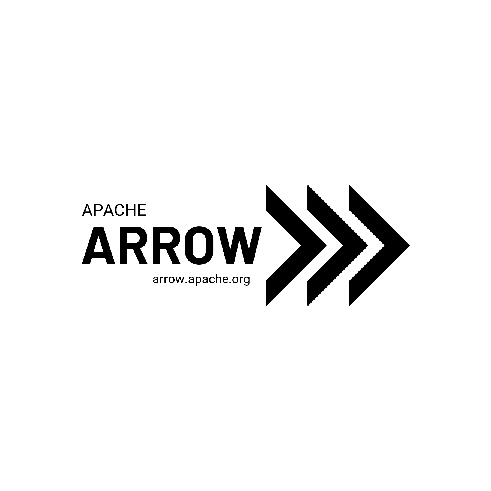
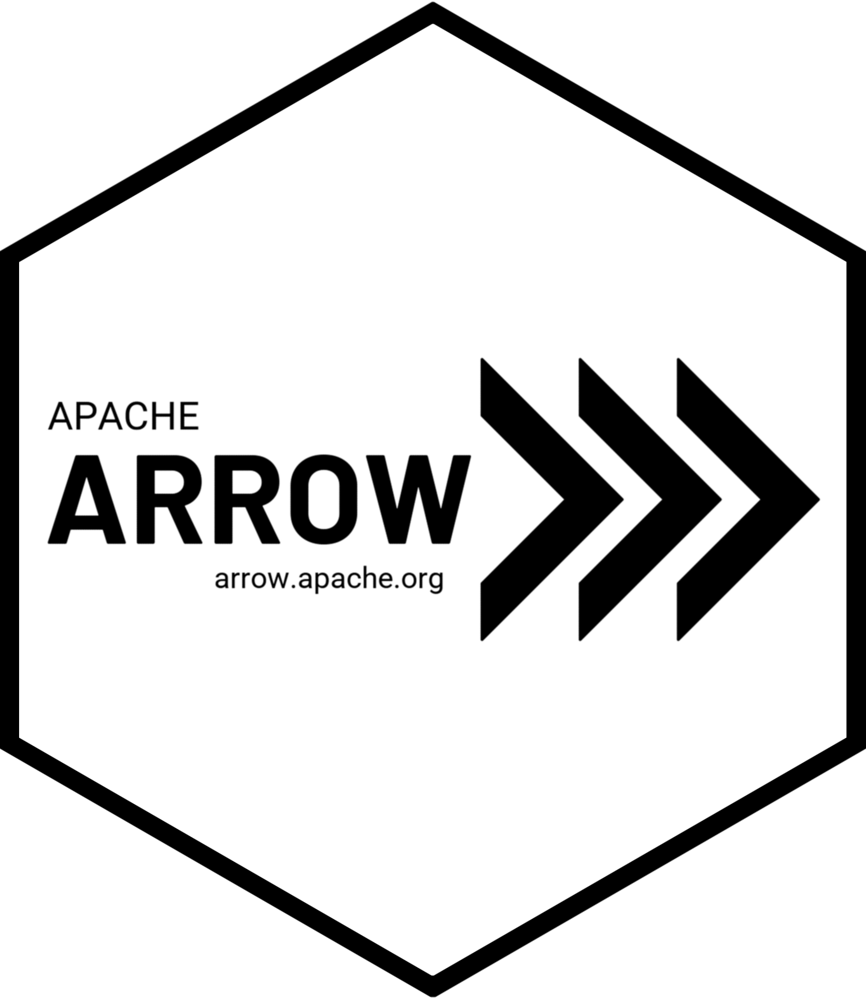

<!-- README.md is generated from README.Rmd. Please edit that file -->

```{r, include = FALSE}
knitr::opts_chunk$set(
  collapse = TRUE,
  comment = "#>"
)
```

# Candidate logos and hex stickers

## Logos

The logo options included here are extremely minor modifications of the [current logo](https://github.com/apache/arrow/blob/master/docs/source/_static/arrow.png): the word "Apache" is written in normal-weight Roboto font (available under an Apache licence) and the word "Arrow" is written in boldfaced Barlow font (available under the SIL Open Font Licence). Both fonts are accessible through Google fonts. The differences between the existing version and the proposed ones are:

- source code to generate the logos is provided
- light themed and dark themed images are provided
- transparent and opaque background images are provided
- png and svg versions are provided

Why is this useful? 

- easier to modify in the future
- allows creation of Apache Arrow branding guidelines similar to [ASF guidelines](https://apache.org/foundation/press/kit/ApacheFoundation_StyleGuide.pdf) or [R-Ladies](https://github.com/rladies/branding-materials) 
- fixes the problem where social media previews for blog posts display incorrectly when the user has dark mode set! 

In essence, it's just a slightly more complete version of the existing logotype with a little more documentation. Anyway, here's what the light and dark themed versions look like


In presentations etc it may be handy to have a version with the URL:




## Hex stickers

Now the fun part! Here are three possibilities that use the existing logo in an essentially unmodified format. 




I'm not very enthusiastic about any of these because the text will be very difficult to read when printed at typical hex sticker size. Here are two vertically oriented versions that I think work better:


Some fine tuning would certainly be worthwhile, but after comparing these images to other hex stickers that I happen to have both on my laptop and as image files, I'd suggest that the "arrow.apache.org" text in these final two is the lower bound on the font size for any text that we want to include.

